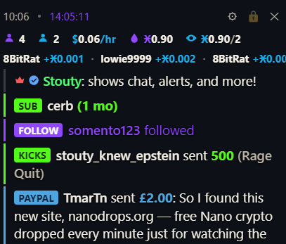

# Kick Stream Overlay

A transparent, always-on-top desktop overlay for Kick + Twitch streamers: live chat, Streamlabs alerts, viewer/stream stats, and nanodrops stats in one window you can lay over a game.

## Features

- **Live chat** — connects directly to Kick (no auth needed) and, optionally, Twitch. Emotes, badges, `/me` messages, and Twitch's first-time-chatter highlight are all rendered. Deleted messages and banned/timed-out users are removed from the feed live.
- **Alerts via Streamlabs** — follows, subs/resubs (with message + emotes), gifted subs, tips (Kicks & PayPal), Twitch bits, and raids. Each alert is colored by platform (Kick green / Twitch purple).
- **Live stats bar** — viewer count and stream uptime (colored by platform), with a small OBS mic-level meter and mute indicators when OBS is connected.
- **nanodrops stats** — your faucet's watchers/balance and network-wide totals, plus a scrolling ticker of recent drops and viewer messages.
- Draggable, resizable, and lockable into click-through mode so it stops eating mouse clicks over your game.

## Download & run (Windows)

1. Go to the [Releases page](../../releases) and download the latest `.zip`.
2. Extract it anywhere — it's a folder, not a single installer, so keep everything together.
3. Run `Kick Stream Overlay.exe` inside the extracted folder.
4. The app isn't code-signed, so Windows will likely show a **"Windows protected your PC"** SmartScreen warning on first launch. Click **More info → Run anyway**.
5. Continue with **First-time setup** below.

## First-time setup

1. Click the gear icon (top-right of the overlay) and fill in:
   - **Channel slug** — your Kick channel's URL slug (e.g. `stouty` for kick.com/stouty).
   - **Streamlabs Socket API token** — from [streamlabs.com](https://streamlabs.com) → Dashboard → Settings → API Tokens → "Your Socket API Token". Use the account linked to your Kick.
   - Optionally tick **Also connect to Twitch chat** and add your Twitch login name.
2. Hit **Save**.
3. Drag the thin top strip to position the window, resize from the bottom-right corner, then press **Ctrl+Shift+L** to lock it into click-through mode. Press it again to unlock. To reopen settings while locked, use the tray icon's "Open Settings" entry.

If chatroom auto-detect ever fails, open `https://kick.com/api/v2/channels/<your-slug>` in a browser, find `"chatroom": { "id": ... }`, and paste that number into the "Chatroom ID" field manually.

## Running from source

For development, or if you'd rather not run a prebuilt `.exe`:

```
npm install
npm start
```
Then continue with **First-time setup** above.

## Settings reference

- **Kick / Twitch** — channel names, and per-platform toggles to force usernames into a fixed brand color instead of the chatter's own color.
- **Streamlabs** — Socket API token.
- **OBS** — optional WebSocket connection for mic/desktop mute icons and a mic level meter; needs host, port, password, and the exact source names from your OBS scene.
- **Show in feed** — per-type toggles: chat, follows, subs, gifted subs, tips, bits, raids, live viewer count, nanodrops stats.
- **nanodrops** — one or two faucet IDs, and decimal places for the drop ticker vs. balance/JUICED alerts.
- **Shortcuts** — rebind the lock and clear-chat hotkeys, and set the new-message grace period (how recent a chat line must be to survive a manual clear).
- **Appearance** — text size, background opacity, top bar opacity.

## Hotkeys

| Keys | Action |
|---|---|
| Ctrl+Shift+L | Toggle click-through lock (rebindable) |
| F21 | Clear the chat feed (rebindable — any single key or combination) |
| Ctrl+Shift+I | Toggle DevTools, only while the overlay window has focus |

## Building a standalone .exe

```
npm run dist
```
Uses `electron-builder` to produce a Windows installer in `dist/`. Run this on a Windows machine (or with Wine configured), since it builds a native Windows target.

## Project layout

```
main.js          Electron main process: window, tray, hotkeys, Streamlabs socket, nanodrops polling
preload.js       Safe bridge between main and renderer
src/index.html   Overlay + settings panel markup
src/style.css    Overlay theme (legible over arbitrary game backgrounds)
src/renderer.js  Kick/Twitch chat, Streamlabs event handling, feed rendering
```
